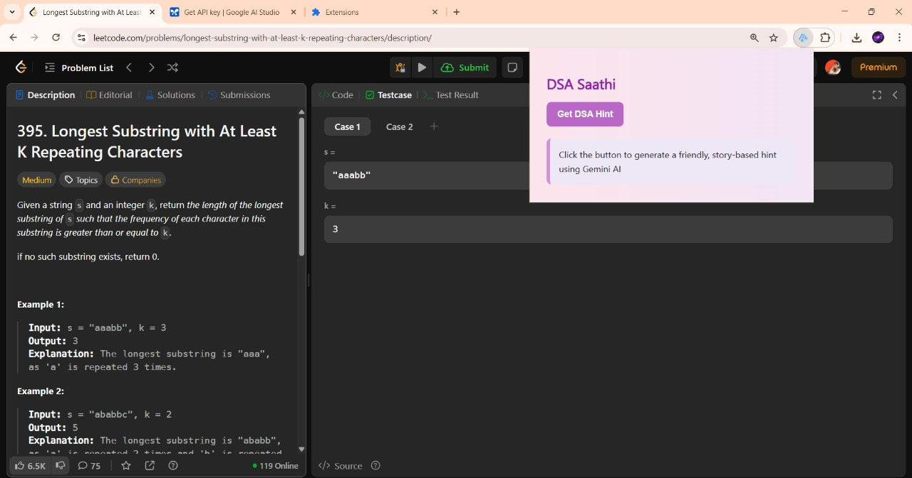
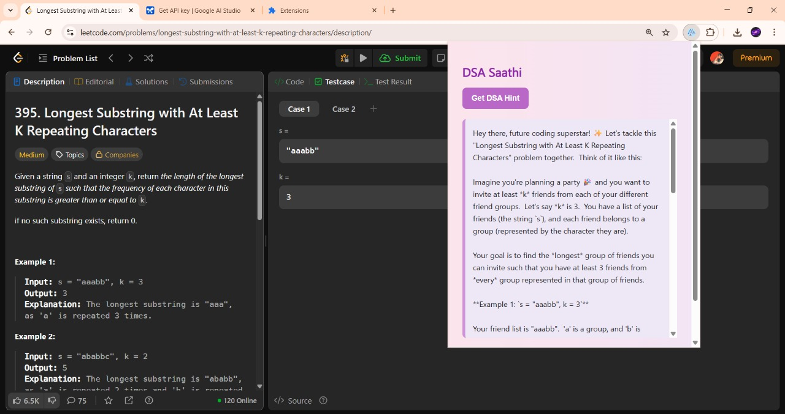

# 💡 DSA Saathi — LeetCode Hints Using Gemini AI

Hey there, future coding superstar! ✨  
**DSA Saathi** is your AI-powered study buddy that gives **conceptual, story-driven hints** on LeetCode problems — right when you need them, while you're solving!

Built as a Chrome Extension using the **Gemini API by Google**, DSA Saathi makes Data Structures and Algorithms feel like a conversation, not a wall of code.

---

## 🧠 What It Does

When you're on a LeetCode problem page, just click **“Get DSA Hint”** in the extension popup.

You’ll receive:
- 📖 **A real-world analogy or story** to help visualize the problem
- 🔍 **Edge case awareness** and problem intuition
- 🧭 **Hints without giving away the code**
- ✨ All wrapped in an easy-to-understand format with friendly emojis!

---

## 💻 Example Response

> “Hey there, future coding superstar! ✨ Let's tackle this "Longest Substring with At Least K Repeating Characters" problem together.  
> 
> Imagine you're planning a party 🎉 and you want to invite at least `k` friends from each of your different friend groups. Let's say `k = 3`. You have a list of your friends (the string `s`), and each friend belongs to a group (represented by the character they are).
> 
> Your goal is to find the *longest* group of friends you can invite such that you have at least 3 friends from *every* group represented in that group of friends.

### 🧪 Example 1
`s = "aaabb", k = 3` → ✅ Result: `"aaa"` → length = `3`

### 🧪 Example 2
`s = "ababbc", k = 2` → ✅ Result: `"ababbc"` → length = `6`

**Patterns:** Use the **sliding window** technique to scan the string and check the frequency of characters inside the window.

**Edge Cases:**
- Empty string → return 0
- No valid substring → return 0

💪 *This problem might seem tricky at first, but breaking it down using analogies like party planning helps! Practice makes perfect.* ✨

---

## 📸 Screenshots


### 🔹 Popup UI


### 🔹 Gemini Response


---

## ⚙️ How It Works

- 📜 Built with `HTML`, `CSS`, and `JavaScript`
- 🤖 Uses the Gemini 1.5 Flash model via Google’s API
- 🧠 Extracts LeetCode problem content from the current tab
- 📬 Sends a prompt to Gemini to generate a story-style DSA hint

---

## 🚀 Features

✅ Instant AI-generated hints  
✅ No spoilers — just the “how,” not the “what”  
✅ Beginner-friendly teaching with analogies  
✅ Uses your own Gemini API key (private & secure)  
✅ Beautiful, emoji-rich UI with colorful loading and feedback

---

## 🔧 Setup Instructions

1. **Get a Gemini API Key**  
   👉 From [Google AI Studio](https://makersuite.google.com/app/apikey)

2. **Clone or Download This Repository**

```bash
git clone https://github.com/shriyanshi-gaur/dsa-saathi.git
